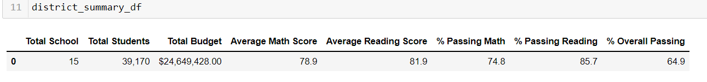

# School_District_Analysis

**Overview of the school district analysis:**
    
In this analysis we are analysing school performance of 15 high schools in a certain school district in colorado, we received information that file shows evidence of academic dishonesty; specifically, reading and math grades for Thomas High School ninth graders appear to have been altered. So my task is to filter 9th graders from Thomas High School and make their math and reading scores to "Nan" and continue analysing school performance based on following metrics
            
        1.School District performance 
        2.Individual school performance 
        3.Top 5 High school 
        4.Bottom 5 High school
        5.Average math and reading score for each grade level from each school
        6.The scores by school spending per student, by school size, and by school type

**Results**

1.Thomas High School math and reading scores for 461 students changed to 
"Nan". following are thomas High school results before change % passing math =66.91 , %passing reading =69.66 and Overall passing =65.07, that changed and Below are the results after removing the 461 scores , % passing math =93.2 , %passing reading =97.0 and Overall passing =90.6 the scores improved because we removed 461 from total sample size.

2.Below data shows that charter school performed better than the district school both in math and reading and overall passing percentage, data also shows that school with less than 2000 students performed better.

3.Here is one intresting data, schools with lower range of per student spending (less than $584 )has performed better than high spending schools. 
        

